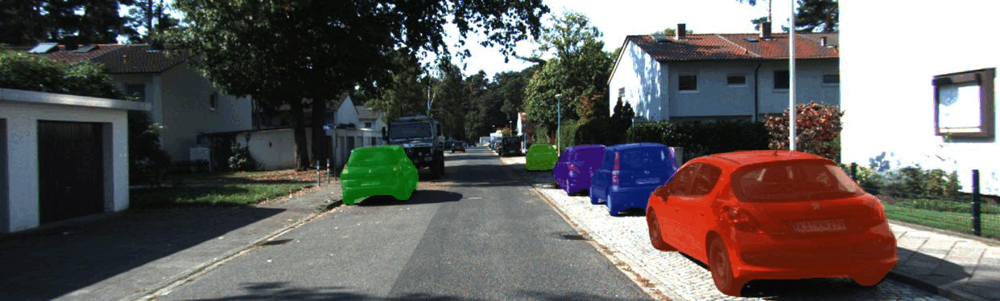
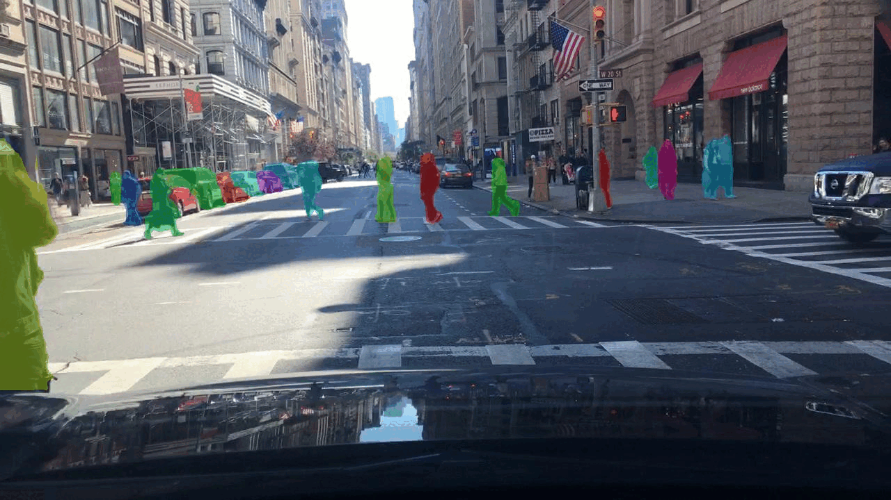
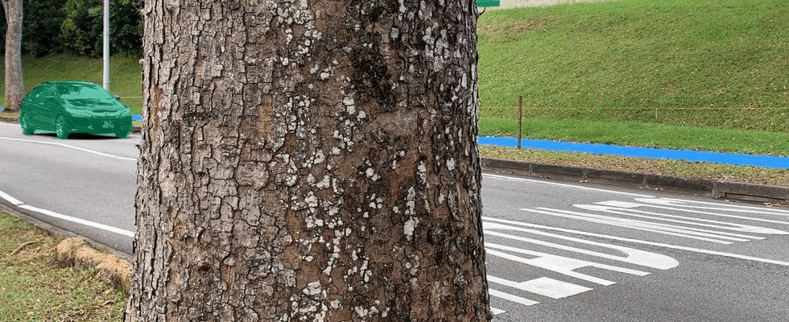

# BoxMOTS
This is the official pytorch implementation for our weakly supervised MOTS work: [Towards High Quality Multi-Object Tracking and Segmentation without Mask Supervision](https://ieeexplore.ieee.org/abstract/document/10539628). This project includes four parts: main model, data association method, optical flow model, and shadow detection model.

## Highlights
- **Box supervised** multi-object tracking and segmentation model. Only bounding box labels are used in the training stage.
- **Superior performance** than previous works. **12.4%** improvement on sMOTSA, **7.3%** improvement on MOTSA, and **8.2%** improvement on MOTSP on the KITTI MOTS dataset.
- **Flexible modules**. Optical flow model and shadow detection model are used on-demand. They can also be replaced by more advanced optical flow/shadow detection models to achieve better performance.

## Visualization Results
BoxMOTS visualization results on KITTI MOTS, BDD100K MOTS, MOSE, and YouTube-VIS 2019 (from top to bottom). For results on MOSE and YouTube-VIS 2019, the BoxMOTS model trained on KITTI MOTS is used to directly make predictions on MOSE and YouTube-VIS 2019, without training on these two datasets.

<table>
  <tr>
    <td></td>
  </tr>
  <tr>
    <td></td>
  </tr>
  <tr>
    <td></td>
  </tr>
  <tr>
    <td></td>
  </tr>
</table>


## Abstract
Recently studies have shown the potential of weakly supervised multi-object tracking and segmentation, but the drawbacks of coarse pseudo mask label and limited utilization of temporal information remain to be unresolved. To address these issues, we present a framework that directly uses box label to supervise the segmentation network without resorting to pseudo mask label. In addition, we propose to fully exploit the temporal information from two perspectives. Firstly, we integrate optical flow-based pairwise consistency to ensure mask consistency across frames, thereby improving mask quality for segmentation. Secondly, we propose a temporally adjacent pair-based sampling strategy to adapt instance embedding learning for data association in tracking. We combine these techniques into an end-to-end deep model, named BoxMOTS, which requires only box annotation without mask supervision. Extensive experiments demonstrate that our model surpasses current state-of-the-art by a large margin, and produces promising results on KITTI MOTS and BDD100K MOTS.

## Main Model
Main model generates detection, segmentation, and object embedding results. This part is contained in the [boxmots](boxmots) folder. Please go to the [README](boxmots/README.md) file under that folder for usage details.

## Data Association Method
We use [DeepSORT](https://github.com/dyhBUPT/StrongSORT) for data association, based on both motion and appearance information. This part is contained in the [StrongSORT](StrongSORT) folder. Please go to the the [README](StrongSORT/README.md) file under that folder for usage details.

## Optical Flow Model
We use the [GMA](https://github.com/zacjiang/GMA) method to generate optical flow results for the KITTI MOTS and BDD100K MOTS training sets. Optical flow results are used to train the main model. This part is contained in the [GMA](GMA) folder. Please go to the the [README](GMA/README.md) file under that folder for usage details.

## Shadow Detection Model
We use the [SSIS](https://github.com/stevewongv/SSIS) method to detect the shadow and remove it from the car-like object's segmentation result. Shadow detection results are used in the inference process. This part is contained in the [SSIS](SSIS) folder. Please go to the [README](SSIS/README.md) file under that folder for usage details.

## TODO
- [x] Repo setup.
- [x] Add code of main model.
- [x] Add code of data association.
- [x] Add code of the optical flow model.
- [x] Add code of the shadow detection model.

## Citation 
If you find this project helpful, feel free to cite our work.
```
@article{cheng2024towards,
  title={Towards High Quality Multi-Object Tracking and Segmentation without Mask Supervision},
  author={Cheng, Wensheng and Wu, Yi and Wu, Zhenyu and Ling, Haibin and Hua, Gang},
  journal={IEEE Transactions on Image Processing},
  year={2024},
  publisher={IEEE}
}
```

## Acknowledgements
- Thanks [AdelaiDet](https://github.com/aim-uofa/AdelaiDet) for the BoxInst implementation.
- Thanks [StrongSORT](https://github.com/dyhBUPT/StrongSORT) for the DeepSORT implementation.
- Thanks [GMA](https://github.com/zacjiang/GMA) for the optical flow model.
- Thanks [SSIS](https://github.com/stevewongv/SSIS) for the shadow detection model.